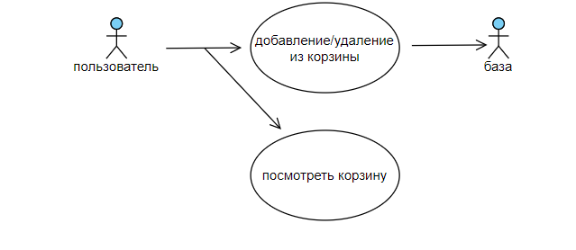

# Поток событий
---

# Содержание
1 [Актёры](#actors)  
2 [Варианты использования](#use_case)  
2.1 [Добавить/удалить товар](#add_alert)   
2.2 [Посмотреть корзину](#show_alert)

<a name="actors"/>

# 1 Актёры

Пользователь - человек, использующий систему  
База - место, где хранятся товары

<a name="use_case"/>

# 2 Варианты использования

Use Case диаграммы сайта "# For All Seasons":

<a name="add_alert"/>

## 2.1 Добавить/удалить товар

**Описание.** Вариант использования "Добавить/удалить товар" позволяет пользователю собирать свою корзину покупок.
1. Пользователь назимает "Добавить в корзину", когда ему нравится товар
2. Пользователь назимает "Удалить из корзины", когда ему товар уже не нужен

<a name="show_alert"/>

## 2.2 Посмотреть корзину
**Описание.** Вариант использования "Посмотреть корзину" позволяет пользователю получить список и сумму всех товаров.
1. Пользователь нажимает на корзину и переходит в окно корзины
2. Пользователь нажимает на крестик и переходит в каталог всех товаров

